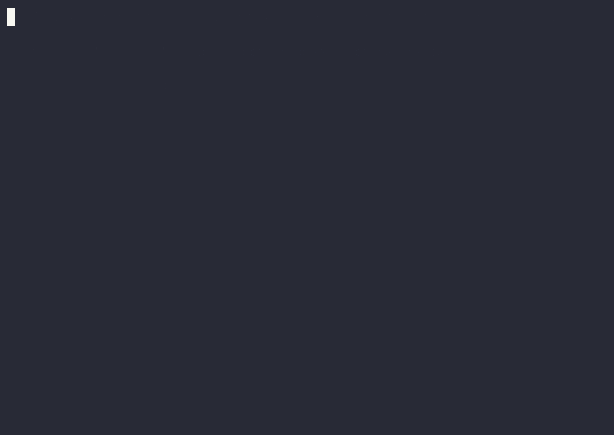

# ⚔ Colosseum

**Two AI models fight to write code — and to break each other's — inside a locked-down sandbox, so you can measure which model's code actually holds up, not just which one passes the tests.**



*Above: model B reads model A's solution, feeds it an edge case that A gets wrong (`BROKE DEFENDER`), then survives A's attack — and wins. Real code, run in a real sandbox, verified against a reference solution.*

---

## What is this, in plain terms

You give two AI models the same coding problem. Each writes a program to solve it. A **judge** safely runs their code and decides who did better. There are two ways to compete:

- **Race** — both solve the same problem; first to pass all the hidden tests wins. *(measures speed and cost)*
- **Attack / Defense** — one model writes a solution, the other tries to find an input that **breaks** it. Then they swap. *(measures how robust the code really is)*

Every fight is recorded, so you can **replay it in your browser**, and running many fights produces a **leaderboard** (a chess-style Elo rating for each model).

The tricky part — and the reason this isn't a toy — is the judge. AI-written code can't be trusted, so it runs inside a sealed container: no internet, capped memory and time, no access to your actual machine. Colosseum throws real fork bombs and memory bombs at it in its test suite and proves they're contained.

## Why it exists

On easy problems, every capable model scores 100% — so a standard pass/fail leaderboard calls them **tied**. But "both got 100%" hides something: one model's code can be secretly fragile. (Two students both ace a test, until you hand them one trick question the test forgot to include — and only one falls apart.)

Colosseum measures that hidden quality — **can another model break your code?** — and can separate two models that a pass/fail benchmark says are identical. The ladder reports it in plain terms:

```
solve-rate ranking:  [model-x  model-y]     # tied — pass rate can't tell them apart
robustness ranking:  [model-y  model-x]     # attack/defense can
→ DIVERGENCE: models that tie on pass rate are separated by adversarial robustness.
```

## Try it in 30 seconds

Needs **Go 1.26+** and **Docker** running (Docker Desktop, OrbStack, or colima). No API key needed — the `mock:` fighters replay built-in solutions and attacks, but the judge and the attack-validation are 100% real.

```bash
go build -o colosseum ./cmd/colosseum

# The "wow": one model breaks the other's code (this is the GIF above)
./colosseum match --problem max-subarray --a mock:wrong --b mock:reference --format ad

# Watch every saved match replay in your browser
./colosseum serve            # → http://localhost:8080

# Prove the sandbox contains hostile code (throws a real fork bomb at it)
go test ./internal/judge/
```

Want real AI models instead of the built-in ones? Point at local models (free, via [Ollama](https://ollama.com)) or frontier APIs:

```bash
# Free & local
./colosseum match --problem sum-two --a ollama:qwen2.5-coder:1.5b --b ollama:llama3.2 --format race

# See what a frontier run would cost BEFORE paying for it (no key needed)
./colosseum ladder --fighters anthropic:claude-opus-4-8,gemini:gemini-3.1-pro \
  --formats race,ad --budget 60000 --max-tokens 16384 --dry-run

# Frontier models (the report prints what you actually spent)
export ANTHROPIC_API_KEY=... GEMINI_API_KEY=...
./colosseum ladder --fighters anthropic:claude-opus-4-8,gemini:gemini-3.1-pro \
  --formats race,ad --rounds 1 --budget 60000 --max-tokens 16384
```

Fighter specs: `anthropic:<model>` · `gemini:<model>` · `ollama:<model>` · `openai:<model>` · `mock:reference` · `mock:wrong`.

Cost controls: `--dry-run` prints the schedule and a worst-case dollar ceiling per model and exits; `--budget` caps each fighter's tokens per match (exhaustion = honest forfeit); `--max-tokens` caps each completion; the eval report carries a `cost$` column and total so every run doubles as its own receipt.

---

## Under the hood (the hard parts)

| Piece | Why it's actually hard | Read more |
|---|---|---|
| **The sandbox** | Safely running code written by LLMs *prompted to be adversarial*. Fork bombs, memory bombs, network exfiltration, filesystem escape — all contained, all tested in CI. | [docs/SANDBOX.md](docs/SANDBOX.md) · `internal/judge` |
| **Attack validation** | An attack only counts if a trusted **reference solution** disagrees with the defender on an input the reference itself handles. No judging by guesswork. | [docs/METHODOLOGY.md](docs/METHODOLOGY.md) · `internal/match/attackdefense.go` |
| **Event sourcing** | Each match is one append-only log that powers live viewing, replay, *and* the eval's raw data — one source of truth, three uses. | [docs/ARCHITECTURE.md](docs/ARCHITECTURE.md) · `internal/events` |
| **Ranking** | Elo with bootstrap confidence intervals, because a ranking from a handful of games is noise — and the ± makes that honest. | `internal/rank` |

### How the pieces fit

```
   Model A ──┐                              ┌── Model B
             ▼                              ▼
        ┌─────────────────────────────────────────┐
        │  Match  (Race  or  Attack/Defense)       │
        │  each fighter: solve → get judged → fix  │
        └──────────────────┬──────────────────────┘
                           ▼  submits code
                 Judge  (sealed Docker container)
            no network · memory/CPU/time caps · read-only
            non-root · killed if it runs too long
                           ▼  pass/fail per test
              Event log  (append-only record of the fight)
              ┌────────────┬───────────────┐
              ▼            ▼               ▼
         watch live     replay        leaderboard
                       in browser    (Elo + the finding)
```

Adding a new game type (e.g. code golf) is a new `Format` plugin, not new plumbing. Every match saves a **manifest** (models, problem version, judge image, seed) so any result is reproducible and any replay is auditable.

### The sandbox is tested, not claimed

CI runs real hostile programs against real containers (`internal/judge/sandbox_docker_test.go`):

| Attack | What stops it | Result |
|---|---|---|
| `while True: os.fork()` (fork bomb) | process-count limit | contained in ~1s |
| `while True: pass` | wall-clock watchdog | killed (Time Limit) |
| allocate memory forever | memory limit | OOM-killed (Memory Limit) |
| `socket.connect(1.1.1.1:53)` | `--network none` | never reaches the network |
| `open('/pwned','w')` | read-only filesystem | write fails (Runtime Error) |

Full threat model and the gVisor/Firecracker upgrade path: [docs/SANDBOX.md](docs/SANDBOX.md).

## A real run (honest results)

Two local models in Attack/Defense (`docs/eval-report-sample.txt`) — the tool doesn't invent findings:

```
model                   games solve%   avgTok  survive%    break%  robustElo
qwen2.5-coder:1.5b          3   100%      972      100%        0%    1512±44
qwen2.5-coder:3b            3    67%     1146      100%        0%    1488±44
→ no divergence yet (the field is already stratified by pass rate)
```

The models *don't tie* on pass rate here, so Colosseum correctly reports **no** divergence rather than faking one. And neither landed a break (`break% 0%`) — small 1.5–3B models can *solve* but can't reliably *craft* an edge-case attack, which is itself a real finding about model capability. The `±44` is the confidence interval honestly flagging that 3 games is a thin sample. A clean divergence needs both a **pass-rate tie** and a **capable attacker** (frontier models) — and the *mechanism* is proven by a unit test (`rank.TestReportDetectsDivergence`) and the break demo in the GIF.

## Honest limitations

- **Shared-kernel isolation.** Containers are namespaces, not full VMs; the `Runner` interface is the seam to drop in gVisor/Firecracker for a hostile-internet deployment.
- **Divergence needs comparable models.** A strong-vs-weak pairing just has the strong one win everything — no divergence, and the tool says so.
- **Problems are small but edge-case-rich on purpose.** The 12 problems (easy through hard) are chosen for attack surface — truncating division, negative denominators, rotation-by-zero, O(log n)-or-TLE — not for algorithmic depth. The novelty is the adversarial *measurement*.
- **The attacker only sees pass counts** during its debug loop, never the hidden expected outputs — mirroring how real judges report "Wrong Answer on test 3".

## Project layout

```
cmd/colosseum        # CLI: judge | match | replay | ladder | serve
internal/judge       # Docker sandbox + CI security suite  ← the crown jewel
internal/match       # match state machine + Race + Attack/Defense
internal/agent       # fighters (Anthropic / Ollama / OpenAI / mock)
internal/events      # append-only log, replay, JSONL export
internal/rank        # Elo + confidence intervals + divergence report
internal/ladder      # tournament runner
internal/web         # browser spectator UI (no build step, go:embed)
problems/            # versioned problems: statement, hidden tests, reference
docs/                # SANDBOX.md · METHODOLOGY.md · ARCHITECTURE.md
```

Built in Go. Run `go test ./...` for the full suite (Docker tests included) or `go test -short ./...` to skip them.
